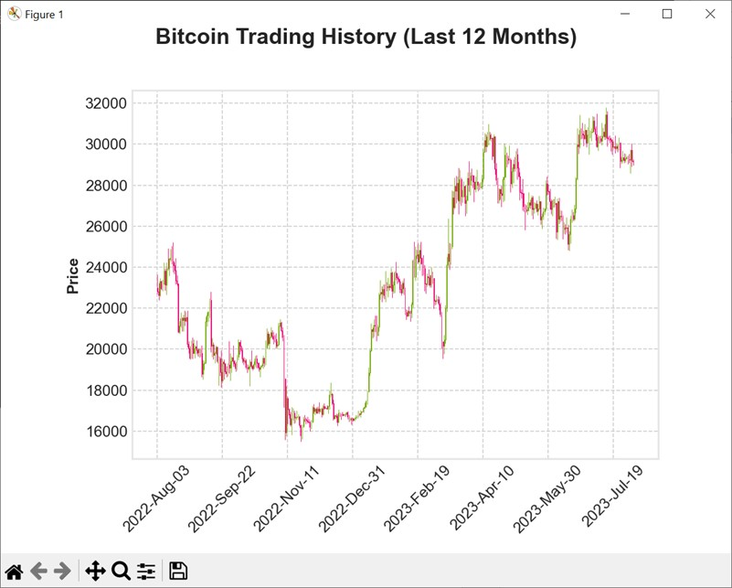

Author: Łukasz Zmywaczyk <l.zmywaczyk@gmail.com>

# 00 download last 2 year btcusdt.py
First execute "00 download last 2 years btcusdt.py", which will create a file 
```
1628035200000,38207.04000000,39969.66000000,37508.56000000,39723.18000000,52329.35243000,1628121599999,2028792778.18480471,1220555,26804.21116900,1039347051.55552658,0
1628121600000,39723.17000000,41350.00000000,37332.70000000,40862.46000000,84343.75562100,1628207999999,3314527738.33973321,1913281,41673.12908100,1638359889.80201597,0
1628208000000,40862.46000000,43392.43000000,39853.86000000,42836.87000000,75753.94134700,1628294399999,3148022459.91615849,2223356,38278.00475800,1591634314.10080118,0
...
```

# 01 visualize data.py
Let's ensure we downloaded the data



# 02 basic stats.py
Over last 2 years are there any significant correlations between 'high' on Friday and 'high' the following day or a few days later ? Let's find out:

```
==Stats for Monday==
Mondays: 0 days had higher high, 0 days had lower high.
Tuesdays: 50 days had higher high, 54 days had lower high.
Wednesdays: 55 days had higher high, 49 days had lower high.
Thursdays: 47 days had higher high, 57 days had lower high.
Fridays: 49 days had higher high, 54 days had lower high.
Saturdays: 39 days had higher high, 64 days had lower high.
Sundays: 44 days had higher high, 59 days had lower high.

==Stats for Tuesday==
Mondays: 47 days had higher high, 56 days had lower high.
Tuesdays: 0 days had higher high, 0 days had lower high.
Wednesdays: 54 days had higher high, 50 days had lower high.
Thursdays: 48 days had higher high, 56 days had lower high.
Fridays: 47 days had higher high, 56 days had lower high.
Saturdays: 40 days had higher high, 63 days had lower high.
Sundays: 43 days had higher high, 60 days had lower high.

==Stats for Wednesday==
Mondays: 41 days had higher high, 63 days had lower high.
Tuesdays: 43 days had higher high, 61 days had lower high.
Wednesdays: 0 days had higher high, 0 days had lower high.
Thursdays: 42 days had higher high, 63 days had lower high.
Fridays: 42 days had higher high, 62 days had lower high.
Saturdays: 32 days had higher high, 72 days had lower high.
Sundays: 36 days had higher high, 68 days had lower high.

==Stats for Thursday==
Mondays: 44 days had higher high, 60 days had lower high.
Tuesdays: 45 days had higher high, 59 days had lower high.
Wednesdays: 44 days had higher high, 60 days had lower high.
Thursdays: 0 days had higher high, 0 days had lower high.
Fridays: 48 days had higher high, 56 days had lower high.
Saturdays: 34 days had higher high, 70 days had lower high.
Sundays: 37 days had higher high, 67 days had lower high.

==Stats for Friday==
Mondays: 42 days had higher high, 62 days had lower high.
Tuesdays: 50 days had higher high, 54 days had lower high.
Wednesdays: 51 days had higher high, 53 days had lower high.
Thursdays: 47 days had higher high, 57 days had lower high.
Fridays: 0 days had higher high, 0 days had lower high.
Saturdays: 31 days had higher high, 73 days had lower high.
Sundays: 45 days had higher high, 59 days had lower high.

==Stats for Saturday==
Mondays: 66 days had higher high, 38 days had lower high.
Tuesdays: 64 days had higher high, 40 days had lower high.
Wednesdays: 60 days had higher high, 44 days had lower high.
Thursdays: 59 days had higher high, 45 days had lower high.
Fridays: 62 days had higher high, 41 days had lower high.
Saturdays: 0 days had higher high, 0 days had lower high.
Sundays: 61 days had higher high, 43 days had lower high.

==Stats for Sunday==
Mondays: 58 days had higher high, 46 days had lower high.
Tuesdays: 58 days had higher high, 46 days had lower high.
Wednesdays: 56 days had higher high, 48 days had lower high.
Thursdays: 58 days had higher high, 46 days had lower high.
Fridays: 56 days had higher high, 47 days had lower high.
Saturdays: 44 days had higher high, 59 days had lower high.
Sundays: 0 days had higher high, 0 days had lower high.
```

Interesting!